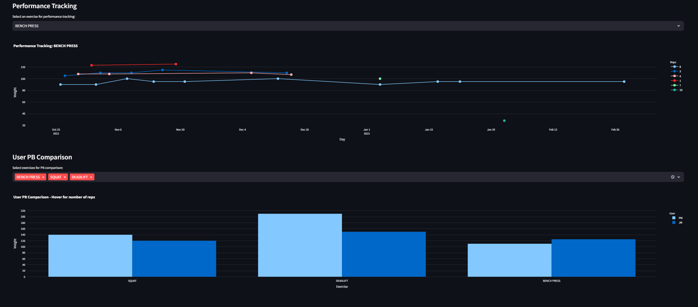

# Fitness Project

This project is a fitness tracker that allows users to record and visualize lift data from workouts, and includes an AI Fitness Advisor chat bot powered by OpenAI's GPT-3.5.



## Table of Contents

- [Aims](#aims)
- [Secondary](#secondary)
- [Application](#application)
- [Requirements](#requirements)
- [Chat Bot](#chat-bot)
- [Learnings](#learnings)
- [Future Development](#future-development)
- [Acknowledgments](#acknowledgments)
- [Licence](#licence)

## Aims

- Record and visualize lift data from workouts, including exercises, sets, reps, and weight, using Google Sheets as a flexible data store.
- Develop a Streamlit web app to serve as a user interface for data input and visualization. The app should allow all users to monitor existing users' performance, but require a password for creating new users and inputting data.
- Use Plotly for creating interactive data visualizations that can help users understand their workout performance trends over time.
- Integrate with OpenAI GPT-3.5 to enable users to query fitness data in natural language, providing additional insight and making the data more accessible.

## Secondary

- Combine Fitbit data with recorded data from workouts, e.g., exercises, sets, reps, and weights.
- Currently, Fitbit data is read from a _.pkl_ file due to issues accessing the data directly in the Streamlit environment.
- Develop Streamlit web app for user interface to collate fitness and lifestyle data.


## Application 
**Link to Gym Performance Tracker Streamlit App:**
[https://gym-tracker.streamlit.app/](https://gym-tracker.streamlit.app/)

## Requirements

Refer to the `environment.yml` file for the required dependencies.

## Chat Bot

The Fitness Project includes an AI Fitness Advisor chat bot powered by OpenAI's GPT-3.5. This bot provides insights, answers questions related to workouts, and analyzes gym data to offer personalized recommendations. The chat bot is integrated into the Streamlit web app, allowing users to interact with the AI advisor seamlessly. It allow users to query fitness data in natural language and respond with relevant SQL code and Plotly visualizations.

### System Requirements

- [OpenAI GPT-3.5](https://beta.openai.com/signup/): To access the powerful language model for the chat bot.
- Python packages listed in [environment.yml](#environment.yml): Ensure you have the necessary dependencies installed.

### Getting Started Yourself

1. Obtain API Key from OpenAI: Sign up for access to the GPT-3.5 model and obtain your API key.
2. Set Up Streamlit App: Make sure you have the Streamlit app running with the required [dependencies](#requirements).
3. Add API Key: Insert your OpenAI API key in the appropriate configuration file or as an environment variable.
4. Interact with the Chat Bot: Open the Fitness Project Streamlit app and start interacting with the AI Fitness Advisor. Ask questions related to your workout, progress, or seek personalized recommendations.

```python
# Sample code snippet for interacting with the chat bot
from openai import OpenAI
import streamlit as st

# Initialize the chat messages history
client = OpenAI(api_key="YOUR_OPENAI_API_KEY")
```

## Learnings

- Streamlit App Production using Streamlit Cloud
- Streamlit Front-End development, key features include password functionality.
- Authenticating API with OAuth2
- Data Visualization with Plotly
- Unit testing
- creating a table in duck_db:
    When you register a DataFrame with DuckDB using the `register` method, you're creating a temporary view of the DataFrame in the database. This allows you to run SQL queries on the DataFrame as if it were a table in the database. However, this view is not persistent - it will not be stored in the database and will disappear when the connection is closed or the program ends.

    If you register the DataFrame but do not create a table, you can still run queries on the DataFrame for the duration of your current program or session, but the data will not be saved in the database for future sessions.

    Here's an example:

    ```python
    if df is not None:
        # Register the DataFrame as a temporary DuckDB table
        con.register(table_name, df)

        # Now you can run queries on the DataFrame
        result = con.execute(f"SELECT * FROM {table_name} WHERE some_column = some_value").fetchdf()

        # But if you close the connection or end the program, the data will not be saved in the database
        con.close()
    ```

    If you want to save the data in the database for future sessions, you should create a table from the DataFrame after registering it.

- Integration with OpenAI GPT-3.5 for natural language processing

## Future Development

- Indication of key areas of growth e.g. leg exercises vs upper body
- Future prediction/planning to target growth of muscle groups and hit lifting goals, involving construction of a simple regression model
- Integration with Strava API as an alternative to Fitbit, this will be more versatile to app users. Opportunity for advanced analytics, for example looking at heart rate zones.

## Acknowledgments

- Thanks to OpenAI for their powerful GPT-3.5 model.
- Thanks to Streamlit for their intuitive app framework.

## Licence

Feel free to customize it further based on your specific needs.
